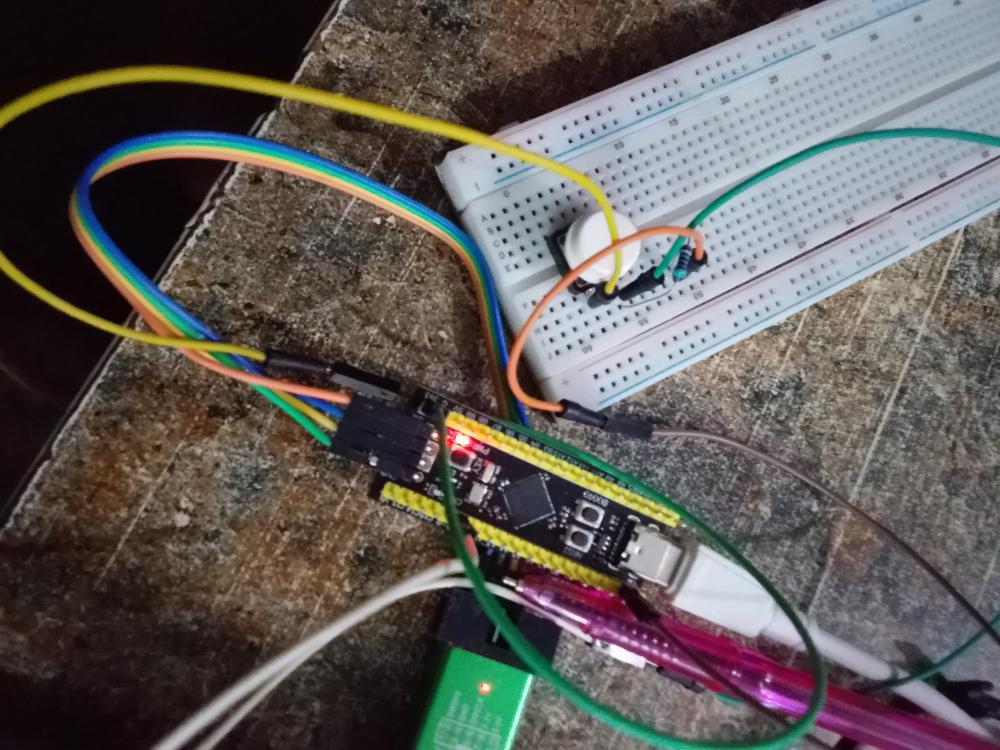

# Button Interrupt LED_stm32f401ccu6

## Overview

A bare-metal STM32 project demonstrating external interrupts (EXTI) using a push button to toggle the onboard LED on the STM32F401CCU6 Black Pill board.

## Project Codes
[Click Here to check out the project code](code)

## Project images


## Hardware

* STM32F401CCU6 Black Pill
* Push Button
* ST-Link V2
* STM32CubeIDE

## Features

* GPIO Input and Output Configuration
* External Interrupt (EXTI0)
* NVIC Configuration
* Interrupt Service Routine (ISR)
* Event-Driven Programming

## Project Demo video
[Click Here to check out the project demonstration Video](https://youtu.be/W-dG8b2Q2J8)


## Program Flow

```text
Button Press
      ↓
PA0 Rising Edge
      ↓
EXTI0 Interrupt
      ↓
EXTI0_IRQHandler()
      ↓
Toggle PC13 LED
```

## Expected Output

Each button press immediately toggles the onboard LED connected to **PC13**, while the `while(1)` loop remains empty.


